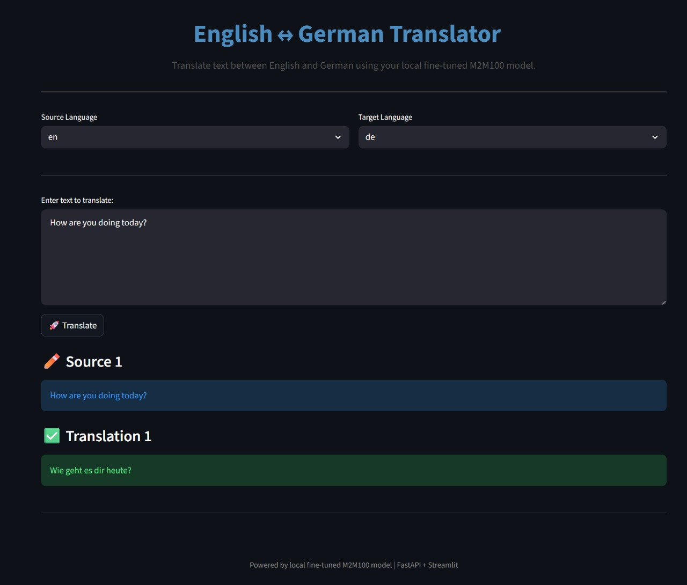

# M2M100-Transformer-Based-Bidirectional-English-German-Neural-Machine-Translation-System

This repository contains a complete, production-aware workflow for fine-tuning Facebook's M2M100 Transformer for bidirectional English ↔ German machine translation, compact back-translation augmentation, evaluation and lightweight serving. It includes:

- A Colab/Jupyter notebook that implements data preparation, training with Hugging Face Trainer, compact back-translation augmentation and evaluation:
  - M2M100_Transformer_Based_Bidirectional_English_German_Neural_Machine_Translation_System.ipynb
- A FastAPI backend that loads the saved model and exposes a /translate endpoint:
  - app_fastapi.py
- A Streamlit frontend that calls the FastAPI service for interactive translation:
  - app_streamlit.py
- Directory for saved models:
  - models/

This README is written to be directly copy/paste-ready for third parties who want a confident, production-minded starting point.

Table of contents
- Project summary
- Design and architecture
- Quick start (local, CPU)
- Recommended environment (GPU)
- Notebook: training & augmentation (detailed)
- Tokenization and generation specifics (M2M100 caveats)
- Evaluation and metrics
- Serving: FastAPI (production notes)
- Frontend: Streamlit (usage and UX notes)
- Examples: curl and Python client
- Advanced production recommendations
- Troubleshooting and FAQs
- Reproducibility and tracking
- Docker / containerization (recipe)
- License and credits

Project summary
This project demonstrates how to:
1. Fine-tune facebook/m2m100_418M on a parallel EN↔DE corpus (example: opus_books de-en).
2. Produce compact back-translation augmentation using the fine-tuned model to synthesize additional parallel data.
3. Evaluate using sacreBLEU and chrF.
4. Serve the model with a small FastAPI app and provide a Streamlit frontend for interactive usage.

Design and architecture
- Notebook: data loading, preprocessing, training, augmentation, plotting and final save.
- Model artefacts: saved using Trainer.save_model and tokenizer.save_pretrained into models/mt_en_de_pipeline (or checkpoint-specific directories).
- FastAPI: single-file microservice loading tokenizer + model and exposing POST /translate for batched translation requests.
- Streamlit: lightweight UI that issues requests to the FastAPI endpoint, handles multi-line input and presents linewise translation results.

Quick start (local, CPU)
1. Create and activate a virtual environment (recommended):
   python -m venv .venv
   source .venv/bin/activate  # Linux / macOS
   .venv\Scripts\activate     # Windows

2. Install dependencies:
   pip install --upgrade pip
   pip install transformers datasets sentencepiece sacrebleu evaluate accelerate matplotlib uvicorn fastapi streamlit requests torch

Note: If installing on a GPU machine, install a torch wheel that includes CUDA (see https://pytorch.org for the correct command).

3. If a trained model is already available, place it under:
   models/mt_en_de_pipeline/
   The directory should contain files such as:
   - config.json
   - pytorch_model.bin (or sharded model files)
   - tokenizer.json / tokenizer_config.json / vocab files

4. Start the FastAPI backend:
   uvicorn app_fastapi:app --host 0.0.0.0 --port 8000 --workers 1

5. Run the Streamlit frontend in another terminal:
   streamlit run app_streamlit.py --server.port 8501

6. Use the UI at http://localhost:8501 or call the API directly.

Recommended environment (GPU)
- GPU is strongly recommended for training and to reduce inference latency.
- Use a CUDA-enabled PyTorch build. Example install:
  pip install torch --index-url https://download.pytorch.org/whl/cu118
- Use mixed precision (fp16) in Trainer by setting fp16=True when torch.cuda.is_available().
- Use accelerate to run across multiple GPUs / nodes if available.

Notebook: training & augmentation (detailed)
Key configuration values used in the reference notebook:
- MODEL_NAME = "facebook/m2m100_418M"
- DATASET_NAME = "opus_books"
- DATASET_CONFIG = "de-en"
- TRAIN_SIZE = 5000
- VAL_SIZE = 500
- TEST_SIZE = 500
- MAX_LENGTH = 128
- BATCH_SIZE = 4
- EPOCHS = 5
- FP16 = True
- BACKTRANSLATE_N = 2000
- SEED = 42
- OUTPUT_DIR = "models/mt_en_de_pipeline"

Main steps implemented:
1. Install required Python packages inside the notebook.
2. Load a parallel dataset via datasets.load_dataset(DATASET_NAME, DATASET_CONFIG). If a test/validation split is absent, the notebook creates a train/test split.
3. Subsample to manageable sizes: TRAIN_SIZE, VAL_SIZE, TEST_SIZE. Always inspect and filter examples to ensure both 'en' and 'de' text exist and are non-empty.
4. Tokenize:
   - Use M2M100Tokenizer; set tokenizer.src_lang and tokenizer.tgt_lang appropriately before encoding/generation.
   - For labels replace pad_token_id with -100 so Trainer ignores padding in the loss.
   - Use DataCollatorForSeq2Seq for dynamic batching.
   - Note: tokenizer.as_target_tokenizer() is deprecated in recent transformers; consult the transformers changelog and replace with processing_class if needed.
5. Trainer setup:
   - Seq2SeqTrainingArguments with:
     - predict_with_generate=True
     - fp16 enabled where possible
     - save_strategy="epoch", eval_strategy="epoch"
     - load_best_model_at_end=True with metric_for_best_model set (e.g., "sacrebleu")
     - early stopping callback to avoid overfit
   - compute_metrics uses sacreBLEU and chrF; metrics require decoded strings (skip_special_tokens=True).
6. Training and saving:
   - trainer.train()
   - trainer.save_model(OUTPUT_DIR)
   - tokenizer.save_pretrained(OUTPUT_DIR)
7. Compact back-translation augmentation:
   - Select BACKTRANSLATE_N sentences in the target language (e.g., DE).
   - Use the fine-tuned model to translate DE→EN to create synthetic sources.
   - Build a synthetic Dataset.from_dict and tokenize it, set format to torch.
   - Concatenate with the original tokenized training set, retrain for N more epochs or fine-tune further with reduced LR.
   - Save final model.

Tokenization and generation specifics (M2M100 caveats)
- Set tokenizer.src_lang and tokenizer.tgt_lang before encoding/generating.
- For generation, use forced_bos_token_id = tokenizer.get_lang_id(tgt_lang) to steer generation to the correct language.
- When converting labels for training, replace pad_token_id with -100.
- For long sequences, consider trimming and using longer max_length only where needed. Use early_stopping in generation for consistent outputs.

Evaluation and metrics
- Use evaluate (sacrebleu) and chrF for robust comparisons.
- compute_metrics should:
  - Decode predictions and labels.
  - Strip surrounding whitespace.
  - Pass predictions and references in the expected shapes to sacrebleu (list of strings, list of list of strings).
- Save evaluation results and the best model checkpoint when using load_best_model_at_end.

Serving: FastAPI (app_fastapi.py)
Key file: app_fastapi.py
- Configuration variables:
  - MODEL_DIR = "models/mt_en_de_pipeline/checkpoint-8750" (update as needed)
  - DEVICE = "cpu" or "cuda"
  - BATCH_SIZE = 4
  - DEFAULT_NUM_BEAMS = 2
- Endpoints:
  - GET / : health/status
  - POST /translate : accepts JSON with keys:
    - texts: list of strings
    - src_lang: string ("en" or "de")
    - tgt_lang: string
    - num_beams: optional int
    - max_length: optional int
  - Returns: {"translations": [...]} with the same order as input lines.

Best-practice serving notes
- Use a single process that loads the model into GPU memory; then run multiple workers in a process manager like gunicorn with uvicorn workers only when the model can be shared or worker_count=1 and use multiple replicas behind a load balancer.
- For low-latency throughput: batch incoming requests and limit max_length.
- Consider quantization (bitsandbytes/LLM.int8, ONNX, TensorRT) for production.
- Use an autoscaling strategy if deploying on Kubernetes.

Frontend: Streamlit (app_streamlit.py)
- Default API_URL in the file: "http://127.0.0.1:8000/translate"
- Streamlit features:
  - Source/target language selection
  - Multi-line input, split into lines and sent to the API as a list
  - Caches last input/output pair in session state to avoid repeat calls
  - Displays results line-by-line
- To run:
  streamlit run app_streamlit.py --server.port 8501

Examples

1) curl example
curl -X POST "http://127.0.0.1:8000/translate" \
  -H "Content-Type: application/json" \
  -d '{"texts":["This is a test sentence."], "src_lang":"en", "tgt_lang":"de", "num_beams":2, "max_length":128}'

Response:
{
  "translations": ["Dies ist ein Testsatz."]
}

2) Python client example
   
```python
import requests
payload = {
    "texts": ["Machine translation improves with more high-quality data."],
    "src_lang": "en",
    "tgt_lang": "de",
    "num_beams": 4,
    "max_length": 128
}
r = requests.post("http://127.0.0.1:8000/translate", json=payload, timeout=180)
r.raise_for_status()
print(r.json()["translations"])
```

Advanced production recommendations
- Model size and latency:
  - If inference latency is a concern, consider a smaller M2M100 variant or distillation.
  - Apply 8-bit or 4-bit quantization when supported by the inference toolkit in production.
- Memory optimization:
  - Use gradient accumulation to emulate larger batch sizes during training without increasing GPU memory.
  - Use torch.compile (where applicable) to speed training/inference with Python 3.11 / latest PyTorch.
- Multi-GPU training:
  - Use accelerate or Trainer with deepspeed for large-scale multi-GPU training.
- CI / Delivery:
  - Add lightweight unit tests for the FastAPI endpoints.
  - Add a GitHub Action that checks formatting and runs a smoke test of the /translate endpoint against a tiny dummy model or a saved minimal model.
- Observability:
  - Add logging for input size, request durations and percentile latencies.
  - Record inference metrics (throughput, latency) and model version in logs.

Troubleshooting and FAQs
- Model fails to load:
  - Confirm that MODEL_DIR points to the folder that contains model and tokenizer files saved by Trainer.
  - Check installed transformers version compatibility with model config.
- Slow CPU inference:
  - Lower batch size and max_length, or move to GPU.
- Empty translations:
  - Make sure src_lang and tgt_lang are set correctly on the tokenizer and that forced_bos_token_id is used for generation.
- Different BLEU/chrF than expected:
  - Check tokenization and whether decode(skip_special_tokens=True) is used consistently for both references and predictions.
- Tokenizer deprecation warnings:
  - tokenizer.as_target_tokenizer() was used historically; verify the notebook for updated API usage in the installed transformers version.

Reproducibility and tracking
- Fix SEED for dataset splits and torch/numpy to improve reproducibility.
- Record package versions (pip freeze > requirements.txt or use environment.yml for conda).
- Save training logs and trainer.state.log_history for plotting loss and evaluation metrics.
- Optionally push artifacts to the Hugging Face Hub or to an object store (S3/GCS).

Docker / containerization (recipe)
- Minimal Dockerfile for the FastAPI server:
  - Use a Python base image, install dependencies, copy the app, copy the saved model, and expose port 8000.
- Example docker-compose service layout:
  - service: backend (FastAPI), service: frontend (Streamlit), models volume mounted or baked into image.

Frontend screenshot:


Contributing
- Add issues or PRs to:
  - Improve training recipe (optimizer schedules, lr finder).
  - Add Dockerfiles and deployment manifests.
  - Add CI tests for API and frontend smoke tests.

License and credits
- License: MIT (add the LICENSE file to the repository).
- Credits:
  - Model: facebook/m2m100_418M
  - Dataset: OPUS (opus_books)
  - Libraries: Hugging Face Transformers, Datasets, Evaluate, FastAPI, Streamlit
